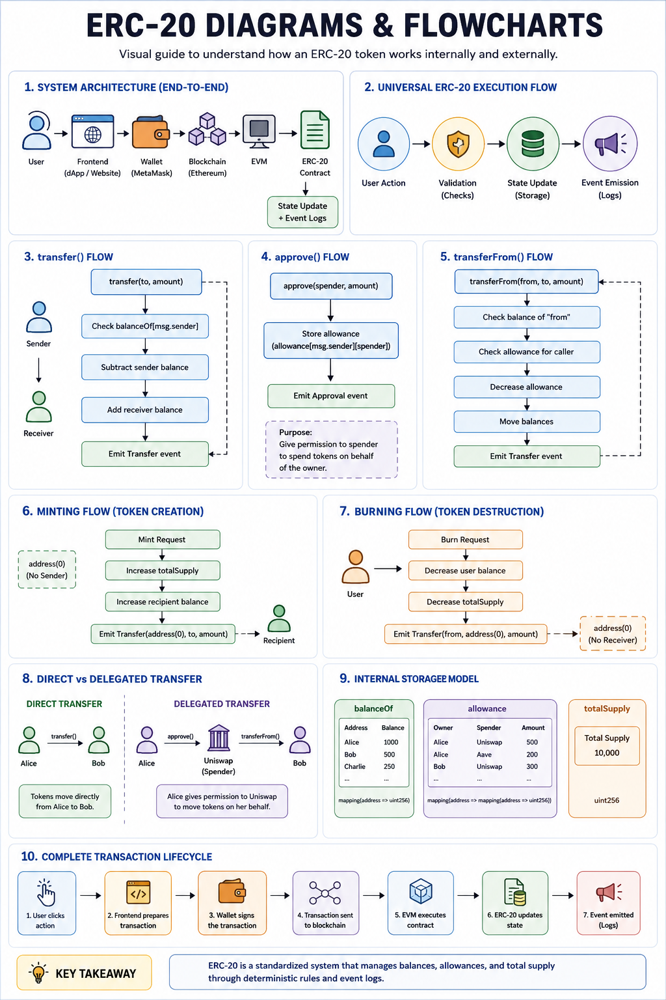

# ERC-20 From Scratch

## Overview

This project is a hands-on implementation of an ERC-20 token built completely from scratch using Solidity.

The goal is not only to create a working token contract, but also to deeply understand:

- why token standards exist
- the problems ERC-20 solves
- how wallets and exchanges interact with tokens
- how balances and allowances work internally
- how smart contracts communicate
- why standardization is critical in blockchain ecosystems

This repository focuses on learning the architecture and internal logic behind ERC-20 instead of blindly copying existing implementations.

---

# Architecture Overview



For deeper technical documentation:

- [Architecture](./docs/architecture.md)
- [ERC-20 Internals](./docs/erc20-internals.md)
- [Implementation Notes](./docs/implementation-notes.md)
- [Diagrams & Flowcharts](./docs/diagrams.md)

---

# What Problem Are We Trying to Solve?

To understand ERC-20 properly, we must first understand the problem that existed before token standards.

---

## Step 1 — Ethereum Originally Had No Standard Token System

Ethereum allows developers to deploy smart contracts.

This means anyone can create their own digital currency by writing a contract.

Example:

```solidity
mapping(address => uint256) balances;
```

This mapping can already represent token ownership.

At this point, we technically have the foundation of a cryptocurrency.

But a major problem appears immediately.

---

## Step 2 — Every Developer Could Build Tokens Differently

One developer might create:

```solidity
send(address to, uint256 amount)
```

Another might write:

```solidity
transferCoins(address receiver, uint256 value)
```

Another might use:

```solidity
moveTokens(address user, uint256 quantity)
```

All of these functions may perform the same operation, but they use different names and structures.

This creates inconsistency across the ecosystem.

---

## Step 3 — Wallets Cannot Understand Every Token Automatically

Wallets like MetaMask need standardized ways to:

- check balances
- transfer tokens
- display token information
- monitor activity

Without a standard, wallets would need custom integration code for every token ever created.

That becomes impossible at scale.

---

## Step 4 — Exchanges Face the Same Problem

Exchanges and decentralized applications also require consistent interaction methods.

They need reliable ways to:

- read balances
- transfer tokens
- request permissions
- execute transactions

Without standardization:

- integrations become expensive
- compatibility breaks
- every token behaves differently
- the ecosystem becomes fragmented

---

## Step 5 — Ethereum Needed a Shared Rulebook

The Ethereum community realized that fungible tokens should follow one common structure.

So they created a standard defining:

- required functions
- expected behavior
- common interaction patterns
- shared event formats

This standard became ERC-20.

---

# What Is ERC-20?

ERC-20 is a technical standard for fungible tokens on Ethereum.

- ERC = Ethereum Request for Comment
- 20 = Proposal number 20

ERC-20 defines a common interface that token contracts must follow.

Because of this:

- wallets can support tokens automatically
- exchanges can integrate easily
- dApps can interact consistently
- developers can build interoperable systems

---

# What Does “Fungible” Mean?

A fungible asset means every unit is interchangeable and equal in value.

Examples:

- 1 USDT = another 1 USDT
- 1 USDC = another 1 USDC

Just like:

- one dollar bill has the same value as another dollar bill

This differs from NFTs, where every asset is unique.

---

# Core ERC-20 Functions

ERC-20 defines several standardized functions.

---

## 1. balanceOf()

Returns how many tokens an address owns.

```solidity
balanceOf(address account)
```

---

## 2. transfer()

Transfers tokens directly to another address.

```solidity
transfer(address to, uint256 amount)
```

---

## 3. approve()

Allows another address or smart contract to spend tokens on your behalf.

```solidity
approve(address spender, uint256 amount)
```

---

## 4. allowance()

Returns how many tokens a spender is allowed to use.

```solidity
allowance(address owner, address spender)
```

---

## 5. transferFrom()

Transfers tokens using a previously approved allowance.

```solidity
transferFrom(address from, address to, uint256 amount)
```

---

# Why approve() and transferFrom() Exist

These functions enable delegated spending.

This is essential for decentralized applications like:

- decentralized exchanges
- staking systems
- lending protocols
- DeFi applications

Example flow:

1. User approves a dApp to spend tokens
2. The dApp calls `transferFrom()`
3. Tokens move within the approved limit

This creates a permission-based system without exposing private keys.

---

# Internal ERC-20 Mental Model

Internally, ERC-20 is fundamentally:

```text
A standardized decentralized accounting system
```

The contract manages:

- balances
- permissions
- total supply
- transfers
- event logs

Everything is based on controlled updates to blockchain storage.

---

# Project Goals

This project aims to build an ERC-20 token step-by-step while understanding:

- state variables
- mappings
- token balances
- transfer logic
- allowance systems
- events
- minting and burning
- security checks
- smart contract interoperability

The focus is educational, architectural, and implementation-oriented.

---

# Technologies Used

- Solidity
- Ethereum Virtual Machine (EVM)
- Remix IDE
- Foundry / Hardhat

---

# Learning Objectives

By completing this project, you should understand:

- why standards matter in distributed systems
- how ERC-20 created interoperability on Ethereum
- how wallets and dApps interact with tokens
- how balances are stored internally
- how delegated spending works
- how events power blockchain interfaces
- how smart contracts communicate through standard interfaces

---

# Repository Structure

```text
ERC20-Project/
│
├── contracts/
│   ├── core/
│   │   └── ERC20.sol
│   │
│   ├── interfaces/
│   │   └── IERC20.sol
│   │
│   └── tokens/
│       └── MyToken.sol
│
├── docs/
│   ├── architecture.md
│   ├── erc20-internals.md
│   ├── implementation-notes.md
│   └── diagrams.md
│
├── images/
│   └── erc20-overview.png
│
└── README.md
```

---

# Final Intuition

Before ERC-20:

```text
Every token spoke a different language.
```

After ERC-20:

```text
All tokens follow the same communication rules.
```

That standardization is what allowed the Ethereum token ecosystem to scale.