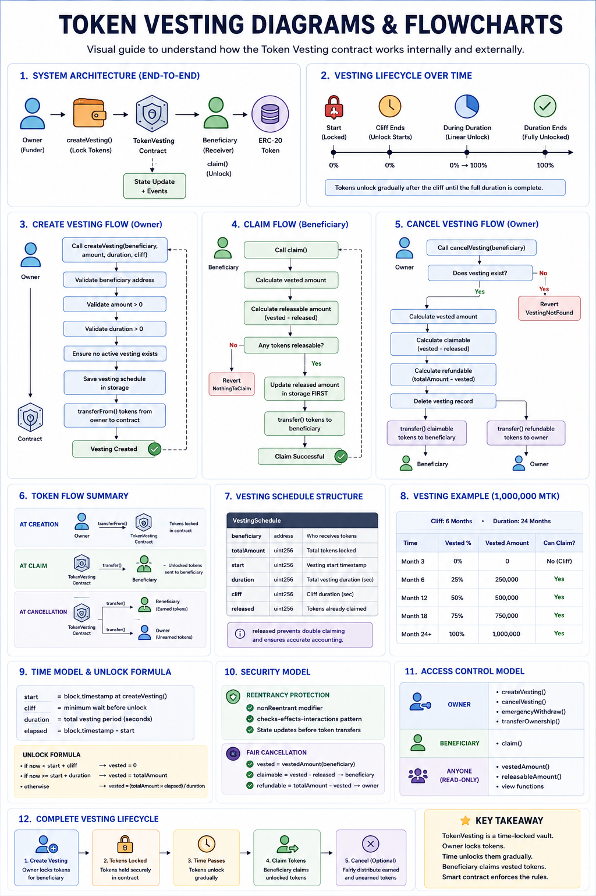

# Token Vesting Contract

## Overview

This project implements a secure ERC-20 token vesting system in Solidity.

The contract locks tokens and releases them gradually over time according to predefined vesting schedules. All distribution rules are enforced directly on-chain through smart contract logic.

The repository is designed for both:

- practical Solidity development
- learning vesting architecture and smart contract security

---

# Token Vesting Architecture & Flows



The diagram above provides a complete visual overview of:

- vesting architecture
- token flow
- claim lifecycle
- cancellation flow
- security model
- access control
- vesting schedule structure
- unlock calculations

---

# Why Token Vesting Exists

Blockchain projects commonly distribute tokens to:

- founders
- investors
- advisors
- team members

Without restrictions, recipients could immediately sell their allocations after launch, causing:

- severe price instability
- reduced investor confidence
- project instability

Token vesting solves this problem by locking tokens and releasing them progressively over time.

The smart contract enforces these rules automatically without relying on trust.

---

# Core Concepts

## Cliff

A minimum waiting period before any tokens become claimable.

## Duration

The total period over which tokens gradually unlock.

## Linear Vesting

After the cliff expires, tokens unlock continuously over time based on elapsed duration.

---

# Example Vesting Schedule

Allocation: **1,000,000 MTK**  
Cliff: **6 Months**  
Duration: **24 Months**

| Time | Unlocked Tokens |
|------|----------------|
| Month 3 | 0 |
| Month 6 | 250,000 |
| Month 12 | 500,000 |
| Month 18 | 750,000 |
| Month 24 | 1,000,000 |

---

# Main Features

- Linear token vesting
- Cliff support
- Secure claiming mechanism
- Fair cancellation logic
- Reentrancy protection
- Ownership management
- Emergency recovery functions
- Read-only vesting inspection

---

# Core Functions

## Owner Functions

```solidity
createVesting()
cancelVesting()
emergencyWithdraw()
transferOwnership()
```

## Beneficiary Functions

```solidity
claim()
```

## Public Read Functions

```solidity
vestedAmount()
releasableAmount()
```

---

# Security Design

## Reentrancy Protection

The contract protects token transfers using:

- `nonReentrant`
- checks-effects-interactions

This prevents recursive withdrawal attacks and double claiming.

---

## Fair Cancellation

When a vesting schedule is cancelled:

- vested tokens remain claimable by the beneficiary
- unvested tokens are refunded to the owner

The owner cannot reclaim already vested allocations.

---

# Documentation

Additional technical documentation:

- [Architecture](./docs/architecture.md)
- [Diagrams & Flows](./docs/diagrams.md)
- [Implementation Notes](./docs/implementation-notes.md)

---

# Repository Structure

```text
03-erc20-vesting/
│
├── contracts/
│   ├── core/
│   │   └── ERC20.sol
│   │   └── TokenVesting.sol
│   │
│   ├── interfaces/
│   │   └── IERC20.sol
│   │
│   └── tokens/
│       └── MyToken.sol
│
├── docs/
│   ├── architecture.md
│   ├── implementation-notes.md
│   └── diagrams.md
│
├── images/
│   └── erc20-overview.png
│
└── README.md

```

---

# Technologies

- Solidity 0.8.30
- ERC-20 Standard
- Remix IDE
---

# Final Mental Model

```text
Owner deposits tokens
        ↓
Contract locks tokens
        ↓
Time unlocks tokens gradually
        ↓
Beneficiary claims vested amounts
```

The contract automatically enforces all vesting rules on-chain.